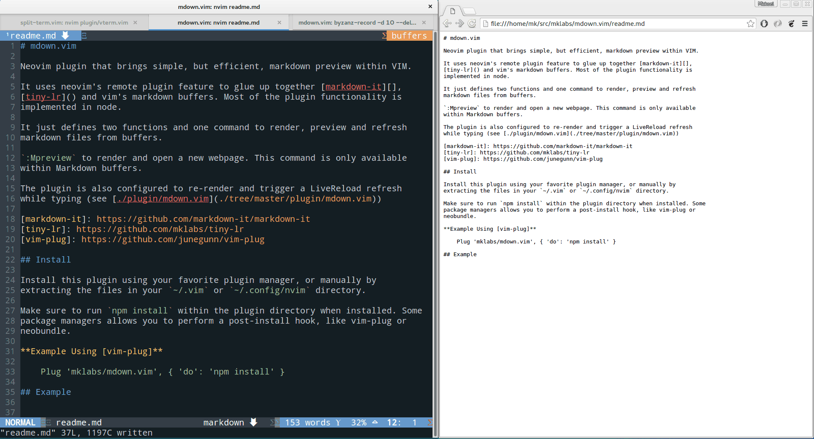

# mdown.vim

Neovim plugin that brings simple, but efficient, markdown preview within VIM.

It uses neovim's remote plugin feature to glue up together [markdown-it][],
[tiny-lr]() and vim's markdown buffers. Most of the plugin functionality is
implemented in node (see [./rplugin/node/mdown.js](./rplugin/node/mdown.js)).

It defines a couple of commands to preview and refresh
markdown files from buffers.

`:Mpreview` to render and open a new webpage. This command is only available
within Markdown buffers.

The plugin is also configured to re-render and trigger a LiveReload refresh
while typing with `:Mpreviewlive`.

To stop updating the preview use `:Mpreviewoff`

You can change the look of the preview by using any of the themes available
[here][theme-repo] using `:Mdowntheme <theme name>`, .ie `:Mdowntheme Base16 Tomorrow`

[markdown-it]: https://github.com/markdown-it/markdown-it
[tiny-lr]: https://github.com/mklabs/tiny-lr
[vim-plug]: https://github.com/junegunn/vim-plug
[theme-repo]: https://github.com/bncoelho/MarkedCustomStyles

## Install

Install this plugin using your favorite plugin manager, or manually by
extracting the files in your `~/.vim` or `~/.config/nvim` directory.

Make sure to run `npm install` within the plugin directory when installed. Some
package managers allows you to perform a post-install hook, like vim-plug or
neobundle.

**Example Using [vim-plug]**

    Plug 'neovim/node-host', { 'do': 'npm install' }
    Plug 'vimlab/mdown.vim', { 'do': 'npm install' }

Once installed, make sure to "update remote plugins" by running `:UpdateRemotePlugins`

## Example

